

 
 

  <a href="https://discord.gg/WMRarXX6">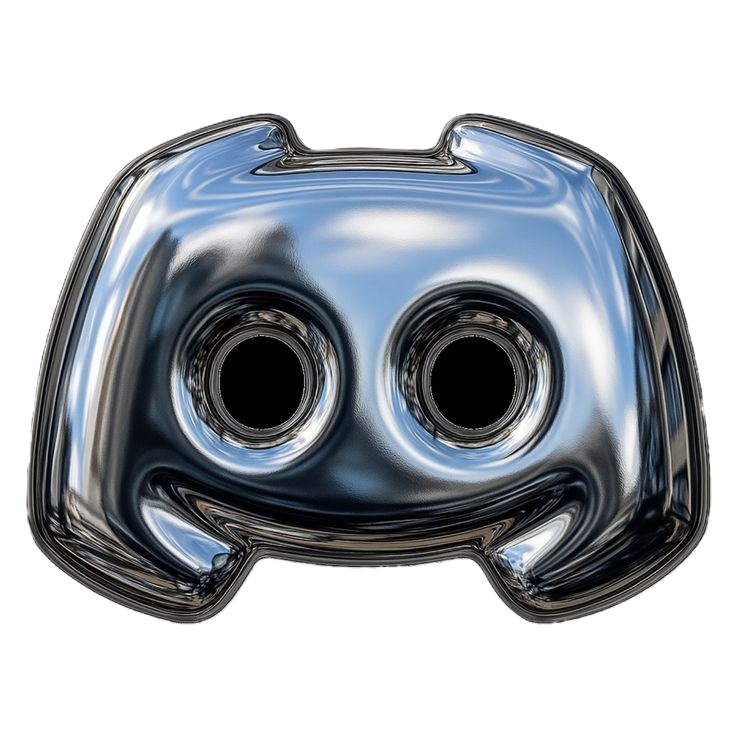</a>&nbsp;&nbsp;&nbsp;&nbsp;&nbsp;
  &nbsp;&nbsp;&nbsp;&nbsp;&nbsp;
  <a href="https://instagram.com/lubannoor">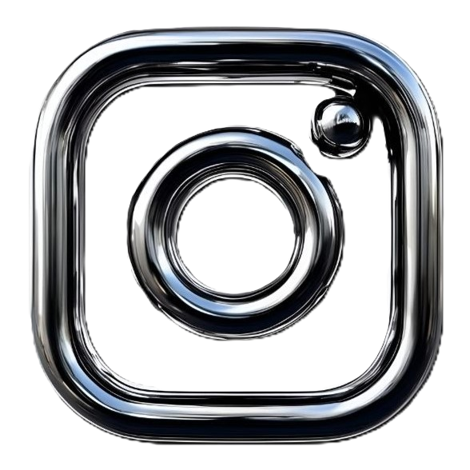</a>&nbsp;&nbsp;&nbsp;&nbsp;&nbsp;
  <a href="https://x.com/LubanNoor">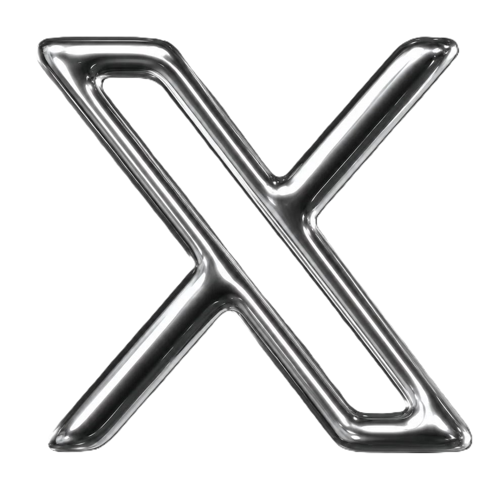</a>&nbsp;&nbsp;&nbsp;&nbsp;&nbsp;
  <a href="mailto:lubanmac@gmail.com">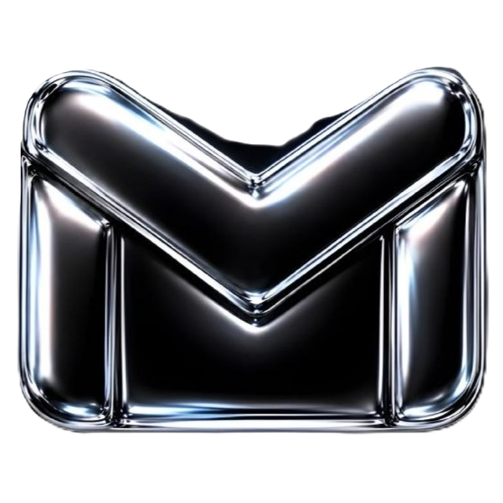</a>&nbsp;&nbsp;&nbsp;&nbsp;&nbsp;
  &nbsp;&nbsp;&nbsp;&nbsp;&nbsp;
  <a href="https://spotify.com/lubannoor">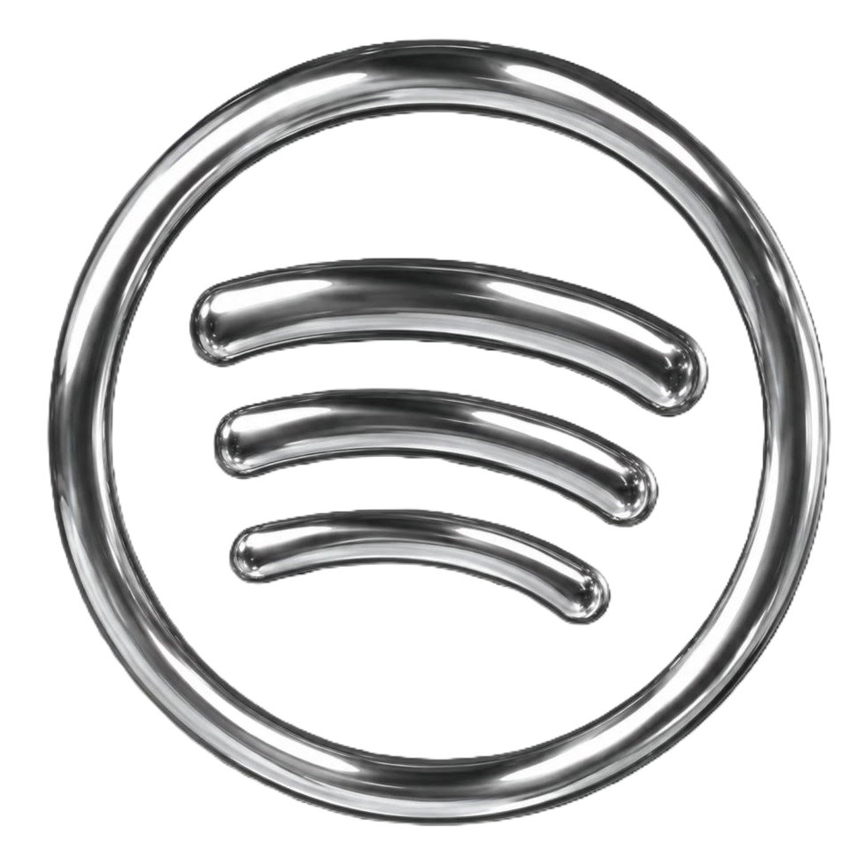</a>&nbsp;&nbsp;&nbsp;&nbsp;&nbsp;
  <a href="https://telegram.com/lubannoor">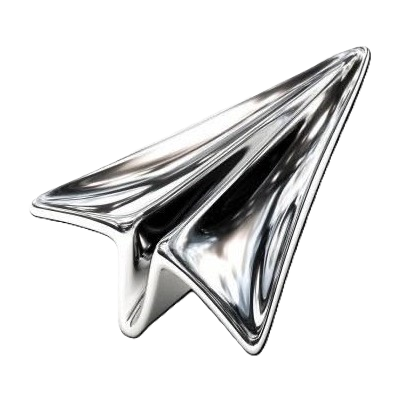</a>&nbsp;&nbsp;&nbsp;&nbsp;&nbsp;
  <a href="https://steamcommunity.com/profiles/76561198645625981/">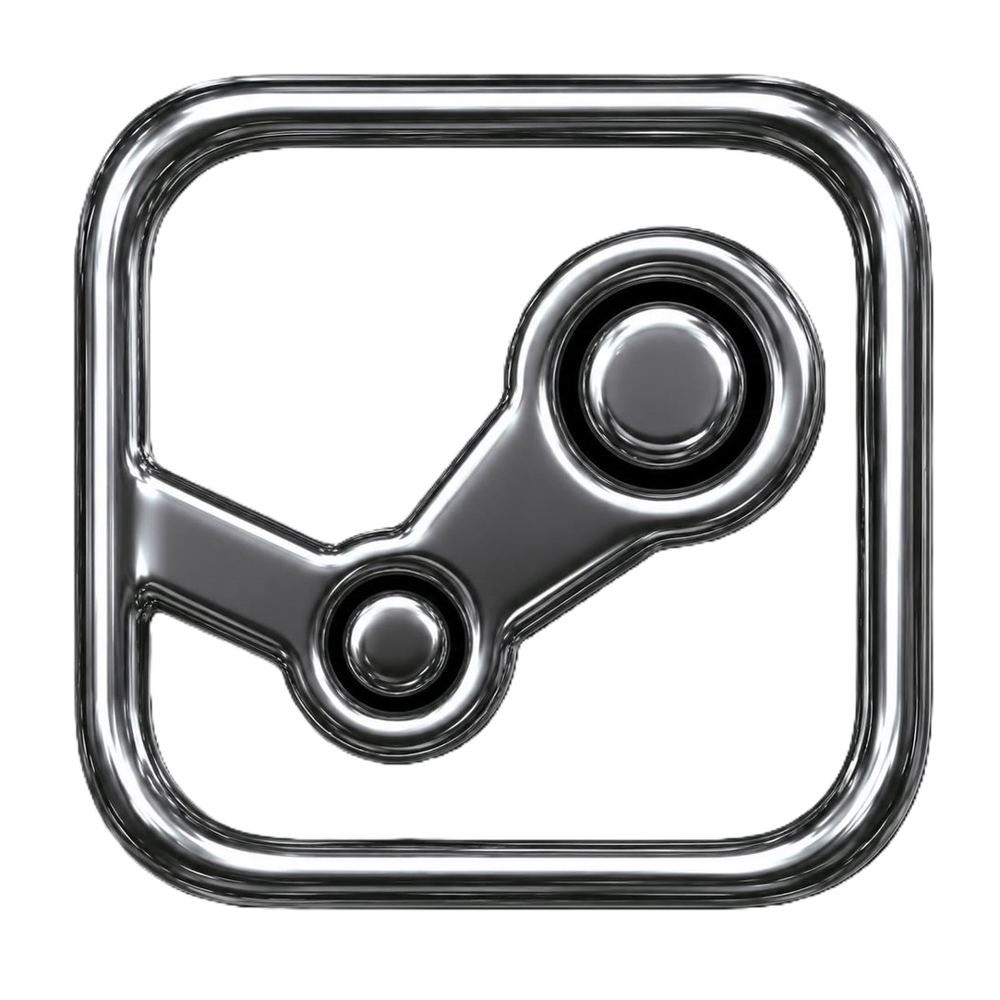</a> 

&nbsp;&nbsp;&nbsp; 

  

 

&nbsp;&nbsp;&nbsp; 

